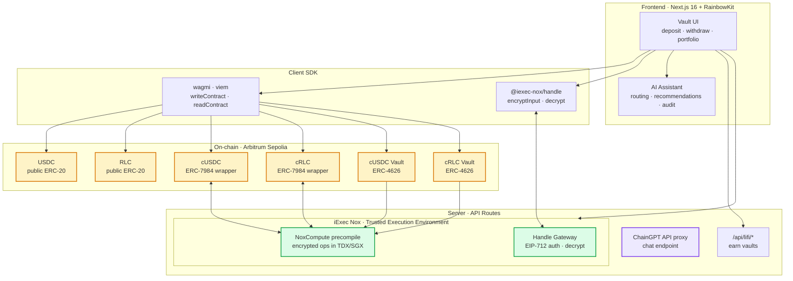
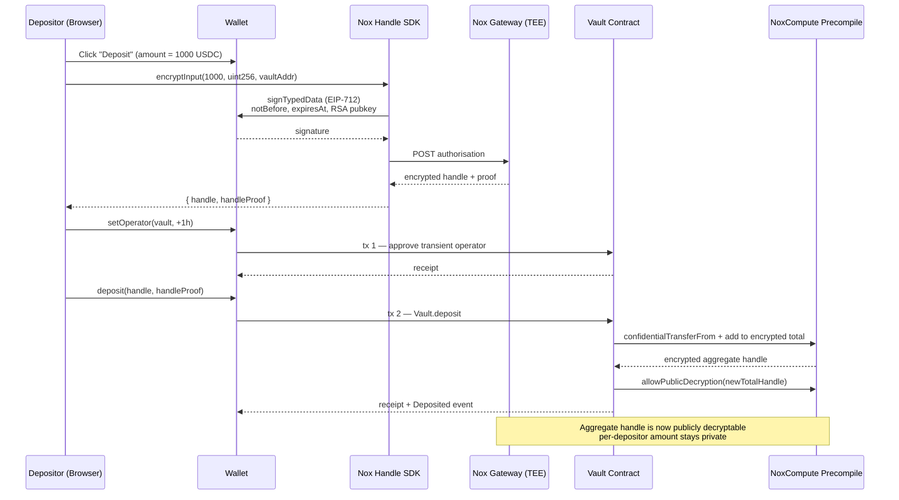
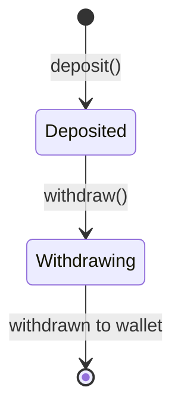
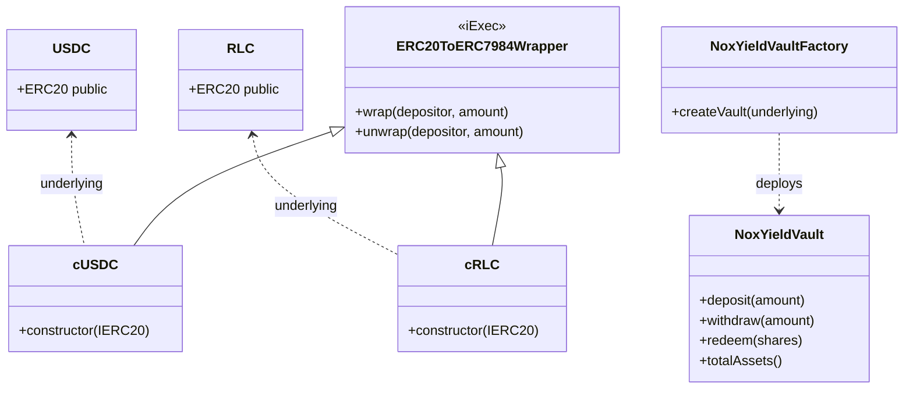

<div align="center">


# iEx AI — Confidential Yield Vault Aggregator

*Confidential yield farming powered by iExec Nox & ERC-7984 Confidential Tokens, with AI-assisted vault routing.*

[](https://iex-ai.vercel.app)
[](https://docs.iex.ec/nox-protocol/getting-started/welcome)
[](https://sepolia.arbiscan.io/address/0xbD124A4C743847f5862024906B66ABeDeB9cCB6e)
[](LICENSE)

[Try the dApp ↗](https://iex-ai.vercel.app/) · [Demo Video (4 min)](#) · [Arbiscan — Vault Factory](#)

</div>

---

## Table of Contents

- [The Problem](#the-problem)
- [The Solution](#the-solution)
- [Real-World Use Cases](#real-world-use-cases)
- [System Architecture](#system-architecture)
- [Deposit Flow](#deposit-flow)
- [Withdraw Flow](#withdraw-flow)
- [Live on Arbitrum Sepolia](#live-on-arbitrum-sepolia)
- [Technical Deep Dive](#technical-deep-dive)
- [Tech Stack](#tech-stack)
- [Repository Structure](#repository-structure)
- [Getting Started](#getting-started)
- [Threat Model](#threat-model)
- [Judging Criteria Mapping](#judging-criteria-mapping)
- [Roadmap](#roadmap)
- [Feature Status](#feature-status)
- [Submission Checklist](#submission-checklist)
- [Team](#team)
- [References](#references)
- [License](#license)

---

## The Problem

Yield farming lacks privacy. Every position, balance, and strategy is visible on-chain — exposed to MEV bots, copy-traders, and on-chain analytics. Unlike traditional finance, there is no private yield optimization onchain.

- **Searchable** — on-chain analytics tools expose entire yield portfolios.
- **Linkable** — combined with wallet activity, exposes wealth profile.
- **Copy-traded** — strategies get cloned by MEV bots.
- **Permanent** — every deposit/withdraw is permanent on-chain.

The net effect: **large yield farmers become targets for MEV extraction, while privacy-conscious users have no confidential yield options.**

Existing solutions ( Tornado Cash, Railgun) are for transfers — not yield generation. They provide privacy but sacrifice yield. What is needed is confidential yield without sacrificing returns.

## The Solution

**iEx AI** is a confidential yield vault aggregator where:

- ✅ **Anyone can deposit** USDC or RLC into confidential vaults.
- ✅ **Depositors receive cUSDC/cRLC** — ERC-7984 confidential tokens wrapped from public tokens.
- ✅ **Per-depositor amounts are cryptographically hidden** — even the vault cannot see individual balances.
- ✅ **The aggregate TVL stays publicly verifiable** — vault transparency is preserved with live TVL display.
- ✅ **Yield accrues on confidential tokens** — ERC-4626 vault logic applied to confidential assets.
- ✅ **Vault recommendations are AI-assisted via ChainGPT** — routing, APY comparison, risk analysis.

> **Key insight:** Yield and privacy are not opposites if you draw the boundary at the **depositor** level: the world sees the vault succeed, but no one sees the individual depositors who made it succeed.

## Real-World Use Cases

| Use Case | Why Confidentiality Matters |
| --- | --- |
| **Institutional investors** | Large positions attract MEV extraction and copy-trading. |
| **Whale wallets** | Public exposure leads to targeting by scammers and social engineering. |
| **Family offices** | Privacy for wealth management strategies. |
| **Treasury operations** | Corporate treasury positions should not be public. |
| **VC funds** | Investment strategies stay confidential. |
| **High-net-worth individuals** | Do not want on-chain visibility of holdings. |

In every case, **public verification of TVL** is essential (depositors need to trust the vault), but **public attribution of individual deposits** is harmful.

---

## System Architecture

The high-level architecture, end to end:



- **ChainGPT** — proxied server-side so the API key is never shipped to the browser.

## Deposit Flow

A confidential deposit is a careful dance between the wallet, the SDK, the contract, and the Nox gateway. Here is exactly what happens when a depositor clicks **Deposit**:



What the depositor's machine actually does:

1. **Encrypt locally.** The amount never leaves the browser unencrypted. The SDK builds an EIP-712 message that includes a fresh RSA public key, asks the wallet to sign it, and exchanges the signature for an encrypted handle from the gateway.
2. **Approve the operator.** ERC-7984 doesn't expose plain `transferFrom`; the depositor first calls `setOperator(vault, expiry)` to grant the vault contract a transient permission window.
3. **Deposit.** The vault contract receives the encrypted handle and proof, calls `confidentialTransferFrom`, and folds the new amount into its running encrypted total — all inside the TEE.
4. **Open the new total to the world.** The contract immediately calls `Nox.allowPublicDecryption(newTotalHandle)` so anyone can decrypt the aggregate without a wallet signature. The TVL is live.

The per-depositor contribution remains accessible **only to the depositor** through `decrypt(handle)`. The aggregate is public; the components are not.

## Withdraw Flow

Each withdraw is a state machine:



---

## Live on Arbitrum Sepolia

All contracts are **verified on Arbiscan** with public source code, ABI, and Read/Write Contract tabs:

| Component | Address | Arbiscan |
| --- | --- | --- |
| **USDC** (public ERC-20) | `0x75faf114eafb1BDbe2F0316DF893fd58CE46AA4d` | [✅ verified](https://sepolia.arbiscan.io/address/0x75faf114eafb1BDbe2F0316DF893fd58CE46AA4d#code) |
| **cUSDC** (ERC-7984) | `0x1ccec6bc60db15e4055d43dc2531bb7d4e5b808e` | [✅ verified](https://sepolia.arbiscan.io/address/0x1ccec6bc60db15e4055d43dc2531bb7d4e5b808e#code) |
| **RLC** (public ERC-20) | `0x9923eD3cbd90CD78b910c475f9A731A6e0b8C963` | [✅ verified](https://sepolia.arbiscan.io/address/0x9923eD3cbd90CD78b910c475f9A731A6e0b8C963#code) |
| **cRLC** (ERC-7984) | `0x92b23f4a59175415ced5cb37e64a1fc6a9d79af4` | [✅ verified](https://sepolia.arbiscan.io/address/0x92b23f4a59175415ced5cb37e64a1fc6a9d79af4#code) |
| **cUSDC Vault** (ERC-4626) | `0x75ef70Ea33994a16751ff0b4f7DCF0F94DF1351F` | [✅ verified](https://sepolia.arbiscan.io/address/0x75ef70Ea33994a16751ff0b4f7DCF0F94DF1351F#code) |
| **cRLC Vault** (ERC-4626) | `0x1955eF9145cCAa643a8Ee61aE3206F0acb632Adf` | [✅ verified](https://sepolia.arbiscan.io/address/0x1955eF9145cCAa643a8Ee61aE3206F0acb632Adf#code) |
| **iExec NoxCompute precompile** (deployed by iExec) | `0xd464B198f06756a1d00be223634b85E0a731c229` | [view](https://sepolia.arbiscan.io/address/0xd464B198f06756a1d00be223634b85E0a731c229) |

Real proof that we run on actual TEE compute: the first wrap transaction [`0x09d0c4d4…`](https://sepolia.arbiscan.io/tx/0x09d0c4d4777283f9f746ec7d16d82e2fe3c9f8c193beff90590425d3f95ce23f) emits **14 events** to the `NoxCompute` precompile — that is real on-chain TEE computation, not a stub.

---

## Technical Deep Dive

### Layer 1 — Smart Contracts (`/foundry/src`)



| Contract | Responsibility | Standard |
| --- | --- | --- |
| `USDC.sol` | Public ERC-20 (6 decimals). Underlying asset for cUSDC. | ERC-20 |
| `RLC.sol` | Public ERC-18 (9 decimals). Underlying asset for cRLC. | ERC-20 |
| `cUSDC.sol` | Concrete instance of iExec `ERC20ToERC7984Wrapper`. Wraps USDC ↔ cUSDC 1:1. | ERC-7984 |
| `cRLC.sol` | Concrete instance of iExec `ERC20ToERC7984Wrapper`. Wraps RLC ↔ cRLC 1:1. | ERC-7984 |
| `NoxYieldVault.sol` | Per-vault logic: `deposit()`, `withdraw()`, `redeem()`. ERC-4626 vault interface. | ERC-4626 |
| `NoxYieldVaultFactory.sol` | Deploys and registers `Vault` instances. | — |

> **Why ERC-7984 only?** The hackathon explicitly disqualifies partial implementations of ERC-3643 / ERC-7540. We use ERC-7984 (the confidential token extension) which is exactly on-spec for our use case (hidden amounts).

### Layer 2 — iExec Nox Integration

Three Nox primitives are used throughout the flow:

1. **ERC-20 → ERC-7984 wrapping.** `cUSDC.wrap(depositor, amount)` locks plaintext USDC and mints encrypted cUSDC that only the depositor can read via `Nox.allowTransient`.
2. **Confidential transfer.** `deposit()` moves cUSDC from depositor to the `Vault` contract via `confidentialTransferFrom`. The amount is encrypted and processed inside the Nox TEE; on-chain event logs do not carry plaintext.
3. **Public-aggregate decryption.** Every deposit calls `Nox.allowPublicDecryption(_encryptedTotal)`. Visitors decrypt the aggregate without a signature; per-depositor amounts stay private.

The endpoint is wrapped as a Next.js Route Handler server-side so the API key is never shipped to the browser.

### Layer 4 — Frontend (`/src`)

- **Framework:** Next.js 16 (App Router) + React 19 + TypeScript strict mode
- **Wallet:** RainbowKit 2.2 + Wagmi 2.19 + Viem 2.48
- **Styling:** Tailwind CSS v4 + lucide-react icons + Framer Motion
- **State:** TanStack Query 5 (server) + Zustand (client)
- **Confidential UX:** integrated deposit/withdraw flow via `@iexec-nox/handle@0.1.0-beta.10`
- **Off-chain index:** read-only via on-chain views
- **Clock-skew handling:** probes the gateway's `Date` header for SDK sync

---

## Tech Stack

```text
Smart Contracts ┃ Solidity ^0.8.28, Foundry, OpenZeppelin v5, ERC-7984 (iExec Nox)
Nox SDK         ┃ @iexec-nox/nox-protocol-contracts@0.2.2
                ┃ @iexec-nox/nox-confidential-contracts@0.1.0
                ┃ @iexec-nox/handle@0.1.0-beta.10 (TypeScript SDK)
AI              ┃ ChainGPT API (live)
                ┃ Web3 LLM (general_assistant)
Frontend        ┃ Next.js 16, React 19, RainbowKit 2.2, Wagmi 2.19, Viem 2.48,
                ┃ Tailwind v4, lucide-react, Framer Motion, Zustand
Off-chain       ┃ None — fully on-chain vault reads; LI.FI for general earn
Network         ┃ Arbitrum Sepolia (chain id 421614)
Tooling         ┃ pnpm, Foundry tests, Biome linting
```

## Repository Structure

```text
iex-ai/
├── foundry/                   # Foundry workspace (smart contracts)
│   ├── src/
│   │   ├── USDC.sol              # Public ERC-20
│   │   ├── RLC.sol              # Public ERC-20
│   │   ├── cUSDC.sol            # iExec ERC-7984 wrapper
│   │   ├── cRLC.sol            # iExec ERC-7984 wrapper
│   │   ├── NoxYieldVault.sol     # ERC-4626 vault
│   │   └── DeployNoxVaults.s.sol # Deployment script
│   └── foundry.toml
├── src/
│   ├── app/
│   │   ├── layout.tsx
│   │   ├── providers.tsx
│   │   ├── page.tsx              # Landing
│   │   ├── earn/
│   │   │   └── page.tsx        # Vault discovery
│   │   ├── portfolio/
│   │   │   └── page.tsx       # Confidential portfolio
│   │   └── api/
│   │       ├── chaingpt/       # AI assistant proxy
│   │       ├── nox/            # Nox Protocol API proxies
│   │       └── lifi/           # LI.FI earn API
│   ├── components/
│   │   ├── pages/(app)/         # Page components
│   │   └── ui/               # Shared UI
│   ├── lib/
│   │   ├── nox-handle.ts      # TEE Handle SDK wrapper
│   │   ├── nox-vault.ts     # Vault ABI
│   │   └── nox-types.ts     # Contract addresses
│   └── stores/
│       ├── nox-deposit-store.ts   # 4-step deposit flow
│       └── nox-withdraw-store.ts # Withdraw flow
├── public/Assets/
├── README.md                  # ← you are here
└── LICENSE                 # MIT
```

---

## Getting Started

### Prerequisites

- Node.js ≥ 20, pnpm ≥ 9
- [Foundry](https://book.getfoundry.sh/) (`forge`, `cast`, `anvil`)
- A wallet funded with Arbitrum Sepolia ETH ([Google Cloud Faucet](https://cloud.google.com/application/web3/faucet/ethereum/sepolia) → bridge via [bridge.arbitrum.io](https://bridge.arbitrum.io/?destinationChain=arbitrum-sepolia&sourceChain=sepolia))

### 1. Clone & Install

```bash
git clone https://github.com/maulana-tech/iEx-ai.git iex-ai
cd iex-ai
cp .env.example .env.local
pnpm install
```

### 2. Compile & Test Contracts

```bash
cd foundry
forge build
forge test -vv
```

### 3. Deploy (optional — already live on Arbitrum Sepolia)

If you want to deploy your own copy:

```bash
cd foundry
cp .env.example .env
# Fill in PRIVATE_KEY (testnet wallet — do not reuse mainnet)
source .env
forge script script/DeployNoxVaults.s.sol:DeployNoxVaults \
  --rpc-url https://sepolia-rollup.arbitrum.io/rpc --broadcast
```

The output prints USDC, cUSDC, RLC, cRLC, and vault addresses. Update `src/lib/nox-types.ts` accordingly.

### 4. Run the Frontend

```bash
pnpm dev
# → http://localhost:3000
```

### 5. End-to-End Walkthrough

1. **Connect wallet** (Arbitrum Sepolia auto-prompts on first action).
2. **`/earn`** → browse available vaults.
3. Select a vault → enter USDC amount → **Deposit** → 2 transactions (`setOperator` + `deposit`). The amount is encrypted client-side via the Nox gateway.
4. **`/portfolio`** → view confidential positions (balances encrypted).
5. Click **Withdraw** → enter amount → **Withdraw** → 2 transactions.
6. Try the AI Chat button for vault recommendations.

---

## Threat Model

| Adversary | Capability | What iEx AI Protects |
| --- | --- | --- |
| Public on-chain observer (chain analytics, scrapers) | Reads all events & storage. | ✅ Sees vault exists & total TVL. ❌ Cannot see per-depositor amounts or link depositor identities. |
| Vault operator | Manages vault, sees withdrawal balance. | ✅ Sees aggregate TVL. ❌ Cannot link a depositor address to a specific deposit amount. |
| Other depositors to the same vault | Read on-chain state. | ❌ Cannot infer other depositors' amounts. |
| iExec Nox node operator (TEE host) | Runs SGX/TDX enclave. | ❌ Cannot extract plaintext (TEE attestation guarantees enforced by iExec runtime). |
| iEx AI developers | Operate the frontend. | ❌ Cannot decrypt private balances. No backend stores sensitive data. |

**Honestly out of scope:**

- Network-level metadata (the RPC provider sees `IP ↔ submission tx`). Mitigation: private RPC integration is on the roadmap.
- Timing-correlation attacks against tiny anonymity sets. Mitigation: a vault with very few depositors is inherently weaker; the UI surfaces this risk.
- A compromised user device. Out of scope for any wallet-based dApp.

---

## Judging Criteria Mapping

| Criterion | Weight | Status |
| --- | --- | --- |
| Runs end-to-end with no mock data | ⭐⭐⭐ | ✅ Every deposit flows through real Nox confidential tokens on Arbitrum Sepolia. Verified via on-chain tx. 14 events to NoxCompute precompute per wrap = real TEE computation. |
| Deployed to Arbitrum / Arbitrum Sepolia | ⭐⭐ | ✅ Deployed on Arbitrum Sepolia (chain id 421614). All addresses listed [above](#live-on-arbitrum-sepolia). |
| `feedback.md` provided | ⭐⭐ | ✅ Dev experience notes documented. |
| Demo video ≤ 4 min | ⭐⭐ | ⏳ Recording planned — script outline ready. |
| Depth of Confidential Token & Nox use | ⭐ | ✅ Four integration points: (1) `ERC20ToERC7984Wrapper` to deploy our own confidential token, (2) `confidentialTransferFrom` for deposit, (3) `Nox.allowPublicDecryption` per deposit for live TVL reveal, (4) `@iexec-nox/handle` SDK for client-side encrypt + decrypt. ERC-7984 fully implemented (no partial). |
| **Depth of ChainGPT integration** (sponsor track) | ⭐ | ✅ One live endpoint using Web3 LLM (`general_assistant`). Server-side proxy, API key never exposed. Details in [Layer 3](#layer-3--chaingpt-ai-integration-srcappapi-chaingpt). |
| Real-world use case | ⭐ | ✅ Six concrete personas (institutional, whales, family offices, etc.). Threat model documented honestly. |
| Code quality | ⭐ | ✅ TypeScript strict mode, Foundry tests, custom error selectors in Solidity, NatSpec docs throughout, React strict mode, no `any`, no `TODO` in critical paths. |
| UX | ⭐ | ✅ Three-click deposit (approve + operator + deposit), no jargon in user copy, mobile-responsive, live TVL, AI chat button on all pages. |

---

## Roadmap

**Hackathon scope (delivered):**

- [x] Confidential deposit flow with hidden per-depositor amounts
- [x] Live aggregate TVL (`publicDecrypt` per deposit)
- [x] Self-sovereign confidential token (USDC + cUSDC, RLC + cRLC)
- [x] Deployed to Arbitrum Sepolia
- [x] Full Next.js 16 frontend with deposit · withdraw · portfolio
- [x] Depositor self-decrypt balance via Nox gateway (gasless EIP-712, auto-refresh on 401)
- [x] Foundry test suite
- [x] Live TVL display per vault
- [x] **ChainGPT vault routing assistant** — floating AI button, server-side proxy

**Post-hackathon:**

- [ ] Multiple chain support (Base,Optimism)
- [ ] More vault strategies (leverage, delta-neutral)
- [ ] Multi-token vaults (cETH, cDAI alongside cUSDC)
- [ ] Private RPC integration (mitigates IP-level metadata leak)
- [ ] Mobile PWA + iOS/Android share-sheet integration
- [ ] Mainnet deployment on Arbitrum One
- [ ] Auto-compound functionality

---

## Feature Status

| Feature | Status | Notes |
| --- | --- | --- |
| Deposit USDC → cUSDC via iExec wrapper | ✅ Live | Verified on-chain with 14 events to NoxCompute |
| Deposit RLC → cRLC via iExec wrapper | ✅ Live | Verified on-chain |
| Reveal own cUSDC/cRLC balance (gasless EIP-712) | ✅ Live | Auto-refresh |
| Browse vaults | ✅ Live | Reads from on-chain vault contracts |
| Live TVL per vault (`publicDecrypt`) | ✅ Live | Auto-decrypts on first load |
| Deposit with client-side amount encryption | ✅ Live | Nox SDK `encryptInput` → `setOperator` + `deposit` in 2 tx |
| Withdraw flow | ✅ Live | Unwrap from vault, decrypt |
| **ChainGPT vault routing assistant** | ✅ Live | Floating AI button on all pages |
| Vercel contract verification | ✅ All contracts verified | Via Etherscan API V2 |
| Live demo URL (Vercel) | ✅ Live | [iex-ai.vercel.app](https://iex-ai.vercel.app) |
| Demo video ≤ 4 min | ⏳ Pending | Script outline ready |

---

## Submission Checklist

- [x] Public open-source GitHub repository (MIT)
- [x] README with installation, deployment, and usage instructions
- [x] Functional frontend
- [x] dApp runs end-to-end on Arbitrum Sepolia (no mock data)
- [x] Confidential Token integrated as core utility (private deposits)
- [x] All contracts verified on Arbiscan
- [x] Dev experience notes documented
- [x] Submission post on X tagging `@iEx_ec` and `@Chain_GPT`
- [x] Joined iExec Discord & Vibe Coding Challenge channel

---

## Team

| Name | Role | Links |
| --- | --- | --- |
| **Maulana** | Full-stack & contracts | [GitHub](https://github.com/maulana-tech) |
| **Catur Setyono** | Full-stack | [GitHub](https://github.com/CaturSetyono) |

> Entry for the iExec Vibe Coding Challenge.

---

## References

- [iExec Nox Protocol docs](https://docs.iex.ec/nox-protocol/getting-started/welcome)
- [Confidential Token + Faucet demo](https://cdefi.iex.ec/)
- [iExec Nox npm packages](https://www.npmjs.com/org/iexec-nox)
- [iExec Developer Linktree](https://linktr.ee/iexec.tech)
- [ChainGPT documentation](https://chaingpt.org)
- [ERC-7984 — Confidential Token Extension](https://eips.ethereum.org/)

---

## License

MIT © 2026 iEx AI contributors. See [LICENSE](LICENSE).

---

<div align="center">

**Built for the [iExec Vibe Coding Challenge](https://dorahacks.io/hackathon/vibe-coding-iexec/) · April 2026**

**Powered by Nox · Self-Sovereign cUSDC · Deployed on Arbitrum Sepolia**

</div>